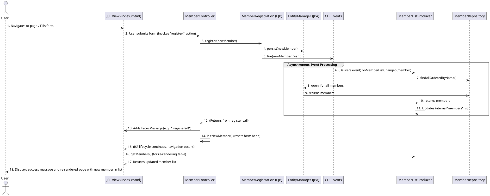

# Original UI Sequence Diagram (Member Registration)

This document contains a sequence diagram illustrating the member registration workflow through the web interface (`index.xhtml`) of the Kitchensink application.

## Member Registration Sequence

**Explanation of Participants:**

*   **User**: The end-user interacting with the web browser.
*   **JSF View (`index.xhtml`)**: The web page rendered in the browser, handles user input and displays data.
*   **`MemberController`**: CDI managed bean (JSF backing bean) that handles UI logic for registration.
*   **`MemberRegistration` (EJB)**: Stateless EJB that handles the business logic of persisting a new member.
*   **`EntityManager` (JPA)**: JPA component responsible for database interactions (persisting, querying).
*   **CDI Events**: Represents the CDI event bus used for decoupled communication.
*   **`MemberListProducer`**: CDI bean that produces the list of members for the UI and observes events to refresh this list.
*   **`MemberRepository`**: CDI bean responsible for data access operations related to members.

This diagram shows the flow from the user initiating a registration, through the backend processing including database interaction and event handling, and finally the UI update reflecting the new registration. 